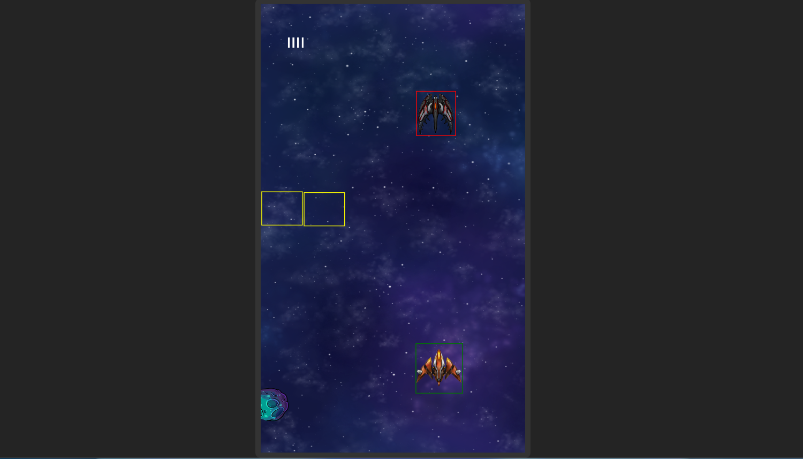

# js-space-war



A Spaceship war game made using pure HTML, CSS and JavaScript.

## Progresso

1. [ ] Player
   - [x] Shoot
   - [x] Movement
   - [ ] Collision Effect
   - [ ] Death Effect
2. [ ] Enemies
   - [ ] Shoot
   - [ ] Movement
3. [ ] Obstacles
   - [ ] Destroy Effect
   - [ ] Movement
4. [ ] Power Up
   - [ ] Destroy Effect
   - [ ] Movement
5. [ ] UI
   - [ ] ...
6. [ ] Sounds
   - [ ] Load before game start
7. [ ] Responsivity
   - [ ] Improve screen size
   - [ ] Adapt to mobile devices

## Estrutura do projeto

```
src/
├── core/						# Núcleo do jogo
	├── game.js					# Classe principal do jogo
	├── main.js 				# Entry point e inicialização
	├── config.js 				# Configurações globais (canvas size, etc.)
	└── constants.js 			# Constantes do jogo
├── engine/ 					# Motor do jogo (sistemas base)
	├── renderer/ 				# Sistema de renderização
		├── sprite.js
		└── animation.js
	├── physics/ 				# Sistema de física
		├── collision-detector.js
		└── particle.js
	├── audio/ 					# Sistema de áudio
		└── sound.js
	├── input/ 					# Sistema de entrada
		├── keyboard.js
		├── gamepad.js
		└── virtual.js
	├── tools/ 					# Utilitários do engine
		├── frame.js
		└── debug.js
	└── index.js 				# Exportações do engine
├── gameplay/ 					# Lógica específica do jogo
	├── entities/ 				# Entidades do jogo
		├── player.js
		├── enemy.js
		├── asteroid.js
	├── projectiles/ 			# Projétils e tiros
		└── shoot.js
	├── systems/ 				# Sistemas de gameplay
		├── spawn-manager.js 	# Gerencia spawn de inimigos/asteroids
		├── score-manager.js 	# Sistema de pontuação
		└── power-up-manager.js # Sistema de power-ups
	└── background.js 			# Background específico do jogo
├── ui/ 						# Interface do usuário
	├── hud.js 					# HUD do jogo (vida, pontos, etc.)
	├── menus/ # Menus do jogo
		├── main-menu.js
		├── pause-menu.js
		└── game-over.js
	└── ui.js 					# Sistema base de UI
├── states/ 					# Estados/Cenas do jogo
	├── game-state.js 			# Estado de jogo ativo
	├── menu-state.js 			# Estado do menu
	├── pause-state.js 			# Estado de pausa
	└── state-manager.js 		# Gerenciador de estados
└── assets/
	├── sounds/
	├── sprites/
	└── spritesheets/
```

## Padrões de Arquitetura:

1. Segue o padrão Entity-Component-System (ECS) parcialmente;
2. Implementa State Pattern para gerenciamento de estados;
3. Usa Module Pattern para organização.
